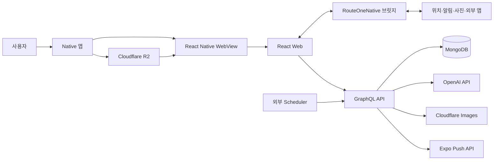
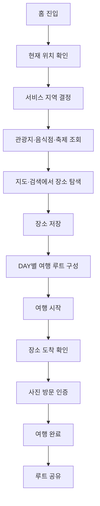

# RouteOne

`RouteOne`은 지역 관광지를 지도에서 탐색하고, 선택한 장소로 날짜별 여행 루트를 만든 뒤 실제 방문과 여행 기록까지 이어가는 하이브리드 여행 앱입니다. React로 구현한 화면을 React Native WebView에서 실행하고, 기기 권한·알림·사진·외부 앱 연동은 Native가 담당합니다.

## 프로젝트 배경

RouteOne은 개발 경험을 넓히고 커리어에 활용할 프로젝트를 만들기 위해 공모전에 참여하면서 시작했습니다. 공모전의 필수 조건이었던 한국관광공사 API를 활용해 어떤 서비스를 만들지 고민했고, 어릴 때부터 자주 여행해 익숙했던 강원도를 주요 지역으로 선택했습니다.

강원도는 바다와 먹거리, 관광 명소가 다양하지만 지역에 익숙하지 않은 사람에게는 잘 알려진 장소 외의 여행지를 찾고 동선을 구성하는 일이 쉽지 않을 수 있습니다. 또한 한국을 찾는 외국인 관광객이 늘어나는 상황에서 서울뿐 아니라 강원도라는 지역도 부담 없이 탐방할 수 있게 만들고 싶었습니다.

그래서 관광 정보를 나열하는 데 그치지 않고, 지역별 장소 탐색부터 날짜별 여행 루트 구성, 실제 방문 기록과 다른 사용자의 루트 공유까지 하나의 흐름으로 이어지는 서비스를 기획했습니다.

### 하이브리드 구조를 선택한 이유

지도 탐색, 검색, 여행 일정과 공유 화면은 Web에서 관리하고, 위치 권한, 푸시 알림, 카메라·앨범, 이미지 저장·공유와 외부 지도 앱 실행은 Native에서 처리합니다. 화면과 서비스 흐름을 Web에서 한 번 구현하면서도 모바일 기기 기능이 필요한 지점은 WebView 브릿지로 연결하기 위해 이 구조를 사용합니다.

## 핵심 기능

| 기능 | 설명 |
| --- | --- |
| 지역별 장소 탐색 | 현재 위치 또는 선택 지역을 기준으로 관광지·음식점·축제를 지도와 검색 결과에서 확인합니다. |
| 여행 루트 구성 | 저장한 장소를 DAY별 일정으로 나누고 출발 위치, 방문 순서와 체류 시간을 구성합니다. |
| 여행 진행과 방문 기록 | 여행 시작 상태, 장소별 방문 여부와 실제 체류 시간을 기록하고 사진으로 방문을 인증합니다. |
| 도착·축제·루트 알림 | 여행 장소 도착, 예정 축제와 여행 완료 후 회고 시점을 로컬·푸시 알림으로 안내합니다. |
| 공유 루트 | 완료한 여행 루트를 공개하고 다른 사용자의 루트를 좋아요·저장하거나 내 일정으로 복제합니다. |
| 다국어 장소 정보 | 관광지 이름, 주소, 카테고리와 소개 정보를 언어별로 변환하고 캐시합니다. |
| 신고와 운영 관리 | 방문 사진과 공유 루트를 신고하고 권한이 있는 계정에서 숨김·검토 상태를 관리합니다. |
| Web 번들 업데이트 | R2 채널에 배포된 새 Web 번들을 Native 앱에서 검증해 설치하고, 실행에 실패하면 이전 번들이나 내장 번들로 복구합니다. |

## 서비스 구성



Web은 Native WebView 안에서 지도 탐색, 여행 일정, 공유 루트와 설정 화면을 담당합니다. 네트워크 프록시와 위치·알림·사진 기능은 `window.RouteOneNative` 브릿지를 통해 Native에 요청합니다. 일반 브라우저 실행은 로컬 개발과 화면 확인에 사용합니다.

API는 사용자, 여행 루트, 방문 기록, 장소 현지화, 알림과 신고 데이터를 GraphQL로 제공합니다. 방문 사진은 Cloudflare Images 직접 업로드 URL을 발급해 저장하고, API에는 사진 참조와 공개 동의 상태를 기록합니다.

## 저장소 구조와 앱별 역할

```text
.
├── apps
│   ├── api              # GraphQL API, 인증, 여행 루트, 알림, 현지화와 운영 기능
│   ├── image-analyzer   # 방문 사진 OCR·장면 분석 서비스
│   ├── native           # WebView 컨테이너와 모바일 기기 기능
│   └── web              # 지도 탐색, 여행 일정, 공유와 설정 화면
├── scripts              # Web 번들·Native 업데이트 정책 R2 배포 스크립트
└── .github/workflows    # Web 번들과 Native 업데이트 정책 배포 자동화
```

| 앱 | 역할 |
| --- | --- |
| `apps/web` | 지도 기반 장소 탐색, 여행 루트 구성·진행, 공유 루트, 알림함과 계정 설정을 담당합니다. |
| `apps/native` | Web을 WebView로 실행하고 로그인 세션, 위치, 알림, 사진, 외부 앱과 Web 번들 업데이트를 연결합니다. |
| `apps/api` | 사용자 인증, 여행 루트와 방문 기록, 장소 현지화, 알림, 신고와 이미지 참조 데이터를 관리합니다. |
| `apps/image-analyzer` | 방문 사진 OCR·장면 분석을 별도로 실험할 수 있는 보조 서비스입니다. 현재 API source에는 호출 연결이 없습니다. |

## 핵심 사용자 흐름



## 기술 스택과 선택 이유

| 영역 | 사용 기술 | 사용 이유 |
| --- | --- | --- |
| Monorepo | pnpm workspace | Web, Native, API와 분석 서비스를 한 저장소에서 관리하고 앱 간 빌드 흐름을 연결하기 위함 |
| Web | React 19, Vite 8, TypeScript, Tailwind CSS 4 | Native WebView에서 실행할 화면과 사용자 흐름을 웹 개발 방식으로 구현하고 관리하기 위함 |
| 클라이언트 상태 | TanStack Query 5, Zustand 5 | 서버 데이터 캐시와 화면·검색·여행 담기 상태를 분리하기 위함 |
| 지도·관광 데이터 | Naver Maps, 한국관광공사 Tour API | 공모전 필수 조건인 한국관광공사 API의 관광지·음식점·축제 데이터를 지역별 지도 탐색으로 연결하기 위함 |
| Native | Expo 56, React Native, React Native WebView | Web을 앱에 내장하면서 위치·알림·사진과 외부 앱 기능을 제공하기 위함 |
| API | Node.js, Fastify, Apollo Server, GraphQL | 클라이언트가 화면에 필요한 필드만 선택해 조회하도록 GraphQL을 사용하고, Apollo Server와 연동되는 Fastify 서버를 Cloud Run의 무료 사용량 범위에서 운영하기 위함 |
| 데이터 | Prisma, MongoDB | 사용자와 여행 루트 데이터를 관리하면서 MongoDB Atlas 무료 티어로 초기 운영 비용 부담을 줄이기 위함 |
| 이미지 | Cloudflare Images | 방문 인증 사진의 직접 업로드와 공개 URL, 삭제 흐름을 관리하기 위함 |
| 배포·업데이트 | GitHub Actions, Cloudflare R2, Expo EAS | Web 번들과 Native 바이너리 배포 주기를 분리하기 위함 |
| 오류 수집 | Sentry | Web, Native, API의 런타임 오류를 앱별로 구분해 확인하기 위함 |

## 빠른 시작

```bash
pnpm install
pnpm --filter api prisma:generate
pnpm dev:api
pnpm dev:web
```

API는 `apps/api/.env`, Web은 `apps/web/.env`에 필요한 값을 설정합니다.

| 대상 | 기본 주소 |
| --- | --- |
| Web | `http://localhost:5173` |
| GraphQL API | `http://localhost:4000/graphql` |
| API 상태 확인 | `http://localhost:4000/health` |
| Image Analyzer | `http://127.0.0.1:4100` |

## 주요 루트 명령어

| 명령어 | 설명 |
| --- | --- |
| `pnpm dev:web` | Web 개발 서버를 실행합니다. |
| `pnpm dev:api` | API 개발 서버를 실행합니다. |
| `pnpm dev:api:test` | GPS 방문 인증 우회가 활성화된 API 개발 서버를 실행합니다. |
| `pnpm dev:analyzer` | 로컬 Image Analyzer를 실행합니다. |
| `pnpm build:web` | Web 타입 검사와 프로덕션 빌드를 실행합니다. |
| `pnpm build:api` | API TypeScript 빌드를 실행합니다. |
| `pnpm lint` | Web ESLint 검사를 실행합니다. |
| `pnpm native:ios:local` | 로컬 iOS 시뮬레이터 앱을 빌드하고 실행합니다. |
| `pnpm native:ios:device` | 연결된 iPhone에 로컬 개발 앱을 설치합니다. |
| `pnpm native:sync:web` | Web을 다시 빌드해 Native 내장 번들에 반영합니다. |
| `pnpm native:typecheck` | Native TypeScript 타입 검사를 실행합니다. |

## 배포와 업데이트

Web 번들은 `develop` 브랜치에서 dev 채널, `main` 브랜치에서 prod 채널로 빌드해 Cloudflare R2에 게시합니다. Native는 내장 번들을 기본으로 준비한 뒤 채널 manifest의 버전과 SHA-256을 확인해 새 번들을 설치합니다.

Native 최소 버전 정책도 dev/prod 채널로 나누어 R2에 게시합니다. 설치 앱 버전이 정책의 최소 버전보다 낮으면 WebView에 진입하기 전에 스토어 업데이트 화면을 표시합니다. Native 바이너리는 Expo EAS 프로필과 App Store Connect 제출 흐름을 사용합니다.

API와 Image Analyzer의 실제 배포 트리거는 저장소에 완전한 설정이 없으므로 각 배포 환경에서 별도로 확인해야 합니다.

## 앱별 상세 문서

| 문서 | 상세 내용 |
| --- | --- |
| [Web README](./apps/web/README.md) | 화면과 라우트, 지도 탐색, 상태 관리, API·Native 브릿지 연결 |
| [Native README](./apps/native/README.md) | WebView 실행, 브릿지, 권한·알림·사진, Web 번들 업데이트와 빌드 |
| [API README](./apps/api/README.md) | GraphQL 도메인, 인증, 알림 스케줄러, 이미지와 현지화 처리 |
| [Image Analyzer README](./apps/image-analyzer/README.md) | 방문 사진 분석 방식, 로컬 실행과 API 형식 |
