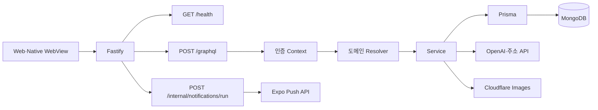
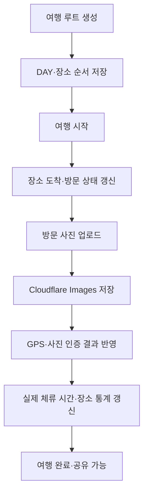

# RouteOne API

`apps/api`는 Fastify와 Apollo Server 기반 RouteOne GraphQL API입니다. 사용자 인증, 여행 루트와 방문 기록, 공유 기능, 장소 현지화, 알림, 신고와 이미지 참조 데이터를 관리합니다.

[루트 README](../../README.md)에는 프로젝트 목적과 전체 서비스 구성을 정리해 두었습니다.

## 역할

- 비밀번호와 Google·Apple 계정 로그인을 처리하고 인증 세션을 발급·갱신합니다.
- 날짜별 여행 루트, 장소 순서, 방문 상태와 실제 체류 시간을 저장합니다.
- 방문 사진 업로드·인증·공개 동의와 장소별 체류 통계를 관리합니다.
- 완료된 공유 루트의 탐색, 좋아요, 저장과 내 일정 복제를 처리합니다.
- 관광지 이름, 주소, 카테고리와 소개 정보를 언어별로 변환하고 캐시합니다.
- 축제·도착·루트 시작·회고 알림과 사용자별 알림 설정을 관리합니다.
- 방문 사진과 공유 루트 신고, 사용자 차단과 운영자 숨김 처리를 제공합니다.
- Cloudflare Images 직접 업로드 URL과 사용 중인 이미지 참조를 관리합니다.

## 기술 스택

| 구분 | 기술 | 사용 범위 |
| --- | --- | --- |
| HTTP 서버 | Node.js, Fastify 4 | Apollo Server를 연결하면서 상태 확인과 내부 Scheduler endpoint를 함께 제공하고, Cloud Run의 무료 사용량 범위에서 실행합니다. |
| GraphQL | Apollo Server 4, graphql-tag | 클라이언트가 화면별로 필요한 필드만 선택하고, 도메인별 SDL과 resolver를 하나의 schema로 구성할 수 있게 합니다. |
| 데이터 | Prisma 6, MongoDB | 사용자와 여행 루트 데이터를 관리하면서 MongoDB Atlas 무료 티어를 활용합니다. |
| 인증 | Bearer Token 기반 세션 | GraphQL 요청 사용자를 확인하고 세션 만료를 관리합니다. |
| 현지화 | OpenAI API, 도로명주소 API | 장소명·주소·카테고리·소개 정보의 언어별 값을 생성합니다. |
| 이미지 | Cloudflare Images | 방문 사진 업로드, variant URL과 참조 상태를 관리합니다. |
| 푸시 | Expo Push API | 등록된 기기로 서버 푸시 알림을 발송합니다. |
| 오류 수집 | Sentry | Fastify와 GraphQL Resolver의 내부 오류를 수집합니다. |

## 구조

```text
apps/api
├── prisma
│   └── schema.prisma
└── src
    ├── graphql          # Scalar와 사용자 노출 오류 변환
    ├── jobs             # 알림·고아 이미지 정리 작업
    ├── lib              # Prisma, 인증, 개발 검증 설정
    ├── modules
    │   ├── auth         # Google·Apple Native OAuth 검증
    │   ├── images       # Cloudflare Images와 이미지 참조 관리
    │   ├── moderation   # 사진·공유 루트 신고 처리
    │   ├── notifications# 알림함, 설정, Scheduler와 Push 발송
    │   ├── places       # 장소명·주소·소개 현지화와 캐시
    │   ├── routes       # 여행 루트, 방문, 공유와 사진 인증
    │   └── user         # 계정과 사용자 차단
    ├── monitoring       # Sentry와 Apollo plugin
    ├── scripts          # 계정·역할·seed 보정 스크립트
    ├── app.ts           # Fastify와 Apollo 구성
    ├── context.ts       # 인증 사용자와 Prisma context 구성
    ├── schema.ts        # 도메인 SDL·resolver 결합
    └── server.ts        # 환경 로드와 서버 실행
```

## 요청 구조



## HTTP endpoint

| 메서드 | 경로 | 설명 | 인증 |
| --- | --- | --- | --- |
| `GET` | `/health` | API 서버 실행 상태를 반환합니다. | 없음 |
| `POST` | `/graphql` | GraphQL Query와 Mutation을 처리합니다. | operation별로 다름 |
| `POST` | `/internal/notifications/run` | 예약 알림을 실행하거나 개발용 테스트 알림을 발송합니다. | Scheduler Bearer Token |

`/internal/notifications/run`은 `Authorization: Bearer <NOTIFICATION_SCHEDULER_SECRET>`가 필요합니다. 지원하는 실행 모드는 구현의 `notificationScheduler.route.ts`를 기준으로 확인합니다.

## GraphQL 도메인

GraphQL schema는 `src/schema.ts`에서 도메인별 SDL과 resolver를 결합합니다.

| 도메인 | 위치 | 역할 |
| --- | --- | --- |
| 사용자 | `src/modules/user` | 계정 조회·수정·탈퇴, 역할과 사용자 차단을 처리합니다. |
| 인증 | `src/modules/auth` | Google·Apple Native OAuth token을 검증하고 로그인에 연결합니다. |
| 여행 루트 | `src/modules/routes` | 루트 생성·수정, DAY·장소, 여행 시작과 방문 상태를 관리합니다. |
| 방문 사진 | `src/modules/routes/routeVisitPhoto.*` | 방문 사진 업로드·검증·공개 동의와 삭제를 처리합니다. |
| 공유 루트 | `src/modules/routes/routeSocial.service.ts` | 완료 루트 공개, 좋아요·저장·복제 흐름을 처리합니다. |
| 장소 현지화 | `src/modules/places` | 장소명·주소·카테고리·소개 번역과 캐시를 처리합니다. |
| 알림 | `src/modules/notifications` | 알림함, 읽음, 설정, Push 기기와 예약 알림을 관리합니다. |
| 운영·신고 | `src/modules/moderation` | 방문 사진과 공유 루트 신고 및 숨김 처리를 제공합니다. |
| 이미지 | `src/modules/images` | Cloudflare Images client와 사용 중인 이미지 참조를 관리합니다. |

## 인증 방식

로그인 Mutation이 발급한 token을 GraphQL 요청의 `Authorization` 헤더로 전달합니다.

```http
Authorization: Bearer <token>
```

`context.ts`는 token을 검증한 뒤 `authenticatedUserId`, `authenticatedSessionExpiresAt`, `user`, `prisma`를 resolver에 제공합니다. 인증이 필요한 operation은 유효한 세션이 없으면 거부됩니다.

비밀번호 계정 생성 허용 여부와 개발용 검증 우회 기능은 환경변수로 분리합니다.

## 여행 루트와 방문 인증



개발 환경에서는 `pnpm dev:api:test`로 GPS 방문 인증 우회를 활성화할 수 있습니다. 운영 환경에서는 위치와 사진 인증 정책을 그대로 적용합니다.

## 알림 처리

외부 Scheduler가 내부 endpoint를 호출하면 알림 서비스가 사용자 설정과 현재 시각, 여행·축제 상태를 확인한 뒤 Expo Push API로 발송합니다.

- 여행 시작 전 알림
- 여행 장소 도착 알림
- 예정 축제 알림
- 완료 루트 회고 알림
- 사용자 알림함 저장과 읽음 처리

알림 정리 작업은 보관 기간을 지난 사용자 알림을 삭제하며 별도 job 스크립트로 실행합니다.

## 장소 현지화

관광지 정보가 요청 언어로 준비되지 않았을 때 장소 현지화 서비스가 번역과 주소 변환을 수행합니다.

1. 기존 `PlaceLocalization` 캐시 확인
2. 장소명·카테고리·소개 정보 번역
3. 필요한 경우 도로명주소 API로 주소 정보 보정
4. 현지화 결과 저장
5. 이후 같은 장소·언어 요청에서 캐시 재사용

## 빠른 시작

`apps/api/.env`에 최소한 MongoDB 연결과 인증에 필요한 값을 설정합니다.

```bash
pnpm install
pnpm --filter api prisma:generate
pnpm dev:api
```

기본 서버 주소는 `http://localhost:4000`이며 GraphQL endpoint는 `http://localhost:4000/graphql`입니다.

## 주요 환경변수

| 변수 | 필요 조건 | 설명 |
| --- | --- | --- |
| `DATABASE_URL` | 필수 | Prisma가 연결할 MongoDB URL입니다. |
| `AUTH_TOKEN_SECRET` 또는 `AUTH_SECRET` | 인증 사용 시 | 로그인 세션 token 서명과 검증에 사용합니다. |
| `GOOGLE_CLIENT_IDS` | Google 로그인 사용 시 | 허용할 Google OAuth client ID 목록입니다. |
| `OPENAI_API_KEY` | 장소 현지화 사용 시 | 장소명·카테고리·소개 번역 요청에 사용합니다. |
| `OPENAI_MODEL` | 선택 | 일반 OpenAI 처리 모델입니다. |
| `OPENAI_TRANSLATION_MODEL` | 선택 | 장소 현지화에 사용할 모델입니다. |
| `JUSO_API_KEY` | 주소 변환 사용 시 | 도로명주소 API 인증 키입니다. |
| `VISITKOREA_SERVICE_KEY` 또는 `TOUR_API_SERVICE_KEY` | 축제 알림 사용 시 | 한국관광공사 데이터 조회 키입니다. |
| `NOTIFICATION_SCHEDULER_SECRET` | Scheduler 사용 시 | 내부 알림 실행 endpoint의 Bearer Token입니다. |
| `SENTRY_DSN` | 오류 수집 사용 시 | `routeone-api` Sentry 프로젝트 DSN입니다. |
| `CF_ACCOUNT` | 방문 사진 업로드 시 | Cloudflare Images account ID입니다. |
| `CF_TOKEN` | 방문 사진 업로드 시 | Cloudflare Images API token입니다. |
| `CF_IMAGES_VARIANT` | 선택 | 방문 사진 공개 URL에 사용할 variant입니다. 기본값은 `public`입니다. |

Cloudflare Images account·token과 이미지 variant 환경변수도 이미지 업로드를 사용하는 배포 환경에 설정해야 합니다. 실제 변수명은 `src/modules/images/cloudflareImages.client.ts`를 기준으로 관리합니다.

## 주요 명령어

| 명령어 | 설명 |
| --- | --- |
| `pnpm dev:api` | API 개발 서버를 실행합니다. |
| `pnpm dev:api:test` | GPS 방문 인증 우회가 활성화된 개발 서버를 실행합니다. |
| `pnpm build:api` | API TypeScript 빌드를 실행합니다. |
| `pnpm --filter api start` | 빌드된 `dist/server.js`를 실행합니다. |
| `pnpm --filter api prisma:generate` | Prisma Client를 생성합니다. |
| `pnpm --filter api prisma:push` | Prisma schema를 MongoDB에 반영합니다. |
| `pnpm --filter api notifications:cleanup:dev` | 개발 환경에서 오래된 알림 정리를 실행합니다. |
| `pnpm --filter api images:cleanup:dev` | 개발 환경에서 고아 이미지 정리를 실행합니다. |

## 빌드와 오류 모니터링

```bash
pnpm --filter api build
```

Fastify 요청과 GraphQL Resolver에서 발생한 내부 오류는 Sentry로 전송합니다. 사용자 식별에는 내부 사용자 ID만 사용하며 요청 본문, URL query, 쿠키와 요청 헤더는 전송 전에 제거합니다. DSN이 없으면 Sentry를 초기화하지 않습니다.
