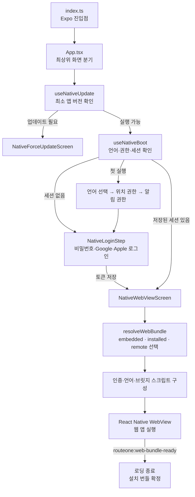
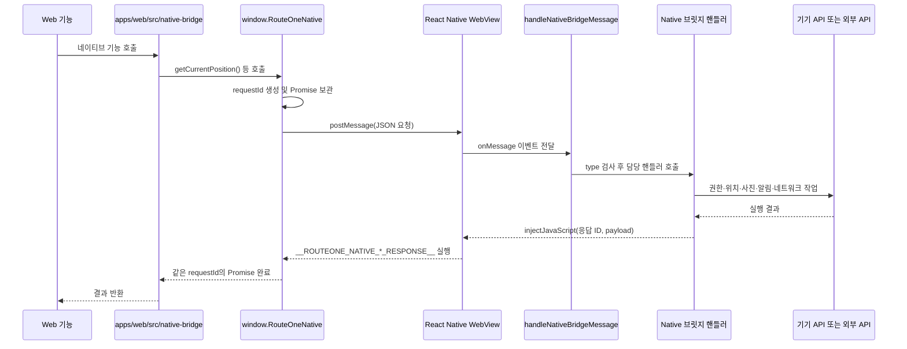

# RouteOne Native

React Native WebView로 `apps/web` 빌드 산출물을 감싸는 하이브리드 앱입니다.

## 명령어

루트에서 실행하는 명령어를 우선 사용합니다.

| 상황 | 명령어 | 설명 |
| --- | --- | --- |
| iOS 시뮬레이터 빌드 테스트 | `pnpm native:ios:local` | `EXPO_PUBLIC_GRAPHQL_ENDPOINT`에 현재 실행 중인 API 주소를 넣고, `APP_VARIANT=none` 앱을 빌드해 시뮬레이터에서 실행합니다. |
| iPhone 실기기 빌드 테스트 | `pnpm native:ios:device` | 연결된 iPhone을 선택하고 Metro에 연결되는 `APP_VARIANT=none` 로컬 개발 앱을 빌드해 설치합니다. |
| dev TestFlight용 Xcode 프로젝트 생성 | `pnpm native:ios:dev` | `APP_VARIANT=dev`로 `ios/`의 `.xcodeproj`와 `.xcworkspace`를 생성 또는 갱신합니다. |
| 로컬 Android 실행 | `pnpm native:android` | `APP_VARIANT=none`으로 Android 앱을 빌드하고 실행합니다. |
| 이미 설치된 dev client 실행 | `pnpm native:start` | 웹 번들을 다시 빌드하지 않고 Metro dev server를 실행합니다. |
| Expo Go 실행 | `pnpm native:start:go` | Expo Go로 확인해야 할 때만 사용합니다. |
| 테스트 중 웹 UI 동기화 | `pnpm native:sync:web` | `apps/web`을 다시 빌드하고 Native WebView 번들을 갱신합니다. |
| 웹뷰 번들 갱신 | `pnpm native:build:webview` | `apps/web/dist`를 native WebView용 번들로 변환합니다. |
| 타입 체크 | `pnpm native:typecheck` | native TypeScript 타입 검사를 실행합니다. |

`pnpm native:ios`는 로컬 실행인지 Xcode 파일 생성인지 헷갈리기 때문에 사용하지 않습니다. 로컬 시뮬레이터 실행은 `native:ios:local`, dev Xcode 파일 생성은 `native:ios:dev`로 구분합니다.

## 빌드 테스트 순서

Native 변경사항은 아래 순서로 확인합니다.

1. `local`: `pnpm native:ios:local`로 iOS 시뮬레이터 빌드 테스트
2. `device`: `pnpm native:ios:device`로 연결된 iPhone 실기기 빌드 테스트
3. `dev`: `pnpm native:ios:dev`로 dev용 Xcode 프로젝트 생성 후 dev TestFlight 빌드 테스트
4. `prod`: dev 검증 완료 후 Expo/EAS에 운영 빌드를 올려 App Store Connect 업로드와 TestFlight 테스트

`local → device → dev → prod` 순서로 진행하며, 앞 단계에서 확인된 빌드만 다음 단계로 넘깁니다.

## 로컬 빌드 테스트 방법

이 앱은 Expo Go보다 native WebView 앱을 직접 빌드해 확인하는 흐름을 기본으로 사용합니다. 테스트할 API는 먼저 별도 터미널에서 실행해 둡니다.

```bash
pnpm dev:api
```

로컬 시뮬레이터와 연결된 iPhone의 Metro 개발 앱을 테스트할 때는 `APP_VARIANT`를 비활성 상태인 `none` 또는 미설정으로 두는 것을 권장합니다. 이 상태에서는 `EXPO_PUBLIC_WEB_BUNDLE_BASE_URL`이 있거나 이전에 원격 번들을 설치했어도 이를 무시하고 앱에 내장된 로컬 번들을 사용합니다. `dev`나 `prod`를 사용하면 variant별 앱 식별자와 R2 원격 웹 번들 채널이 적용되어, `native:sync:web`으로 갱신한 로컬 UI 대신 저장되어 있던 번들이나 원격 번들이 열릴 수 있습니다. 이 경우 현재 수정한 화면을 테스트하는지 구분하기 어려워집니다.

루트 명령어인 `pnpm native:ios:local`과 `pnpm native:ios:device`는 `APP_VARIANT=none`을 자동으로 적용하므로 별도로 설정할 필요가 없습니다. Native 패키지 안에서 하위 명령어를 직접 실행할 때만 `APP_VARIANT` 값을 확인합니다.

### iOS 시뮬레이터 빌드 테스트

로컬 iOS 시뮬레이터에서 테스트할 때는 `EXPO_PUBLIC_GRAPHQL_ENDPOINT`에 현재 실행 중인 API의 GraphQL 주소를 넣고 실행합니다. API를 기본 포트로 실행 중이라면 아래처럼 사용할 수 있습니다.

```bash
EXPO_PUBLIC_GRAPHQL_ENDPOINT=http://127.0.0.1:4000/graphql pnpm native:ios:local
```

시뮬레이터에서는 `127.0.0.1`이 현재 Mac을 가리키므로 로컬 API에 바로 연결할 수 있습니다. 다른 포트나 배포 API를 사용하고 있다면 `EXPO_PUBLIC_GRAPHQL_ENDPOINT`를 해당 API 주소로 바꿉니다.

`native:ios:local`은 내부적으로 아래 일을 실행합니다.

- `APP_VARIANT=none` 설정
- `apps/web/dist`를 native WebView 번들로 동기화
- `expo prebuild --platform ios` 실행
- iOS 권한 문구 동기화
- `expo run:ios`로 시뮬레이터 실행

### iPhone 실기기 빌드 테스트

USB로 연결된 iPhone에서 테스트할 때는 `EXPO_PUBLIC_GRAPHQL_ENDPOINT`에 현재 Mac에서 실행 중인 로컬 API 주소를 넣고 아래 명령어를 사용합니다.

```bash
EXPO_PUBLIC_GRAPHQL_ENDPOINT=http://192.168.0.144:4000/graphql pnpm native:ios:device
```

`192.168.0.144` 부분은 현재 Mac의 LAN IP로 바꿉니다. 실기기에서 `127.0.0.1`은 Mac이 아니라 iPhone 자신을 가리키므로 로컬 API에 연결할 수 없습니다. Mac과 iPhone은 같은 네트워크에 있어야 합니다.

명령 실행 후 표시되는 기기 목록에서 현재 연결된 iPhone을 선택합니다. 그러면 Metro 개발 서버에 연결되는 네이티브 개발 앱을 새로 빌드해 선택한 iPhone에 설치하고 실행합니다. 기존 앱이 설치되어 있으면 같은 앱 식별자의 새 빌드로 교체하며, `APP_VARIANT=none`을 사용하므로 R2 원격 웹 번들을 확인하지 않습니다.

### 테스트 중 웹 UI 수정 사항 반영

`native:ios:local` 또는 `native:ios:device`로 앱을 실행한 상태에서 `apps/web`의 UI를 수정했다면 아래 명령어로 웹 화면을 갱신합니다.

```bash
pnpm native:sync:web
```

이 명령어는 `apps/web`을 다시 빌드하고 결과물을 `apps/native/src/generated/webBundle.ts`에 동기화합니다. 실행 중인 Metro가 변경된 번들을 감지하면 시뮬레이터나 iPhone에서 수정한 웹 화면을 다시 확인할 수 있습니다. 화면이 자동으로 바뀌지 않으면 앱을 한 번 새로고침합니다.

웹 UI만 수정했다면 Xcode 프로젝트를 다시 만들 필요는 없습니다. 네이티브 코드, 권한 또는 네이티브 의존성을 변경한 경우에는 `native:ios:local` 또는 `native:ios:device` 빌드를 다시 실행합니다.

### 설치된 개발 앱 다시 실행

이미 앱이 설치되어 있고 Metro만 다시 띄우면 되는 상황에서는 아래 명령어를 사용합니다.

```bash
pnpm native:start
```

## iOS 프로젝트 생성과 배포 과정

Xcode 프로젝트를 준비하는 `prebuild`와 TestFlight에 올릴 앱 바이너리를 만드는 EAS 빌드는 서로 다른 단계입니다. 프로젝트 설정의 진입점은 `app.config.ts`이고, 실제 `ios/` 프로젝트 생성은 Expo CLI의 `expo prebuild`가 담당합니다. 앱을 실행할 때 사용하는 `index.ts`와 `App.tsx`는 이 생성 과정에 참여하지 않습니다.

### dev Xcode 프로젝트 생성

시뮬레이터와 연결된 iPhone 테스트를 마친 뒤 아래 루트 명령어로 dev Xcode 프로젝트를 준비합니다.

```bash
pnpm native:ios:dev
```

```text
pnpm native:ios:dev
→ APP_VARIANT=dev, ROUTEONE_BUILD_PLATFORM=ios 설정
→ app-versions.json의 dev.ios 버전 확인
→ apps/web 빌드 및 Native WebView 번들 생성
→ app.config.ts에서 dev 앱 이름·Bundle ID·권한·플러그인 구성
→ expo prebuild --platform ios로 ios/ 프로젝트 생성·갱신
→ Info.plist, Google URL Scheme, Apple 로그인 entitlement 보정
```

명령어를 실행하는 동안에만 dev 설정을 사용하며 `.env` 파일의 값은 변경하지 않습니다. 실행이 끝나면 `apps/native/ios/`에 Xcode에서 열 수 있는 `.xcodeproj`와 `.xcworkspace`가 생성됩니다. 이 단계만으로는 TestFlight에 앱이 올라가지 않습니다.

각 단계의 담당 파일은 다음과 같습니다.

| 단계 | 담당 파일 또는 도구 | 역할 |
| --- | --- | --- |
| 명령 연결 | 루트 및 `apps/native/package.json` | 환경값을 설정하고 확인·웹 번들·prebuild 명령을 순서대로 실행 |
| 앱 설정 | `app.config.ts` | 앱 이름, Bundle ID, 버전, 권한과 Expo config plugin 구성 |
| 웹 번들 | `scripts/sync-web-build.mjs` | `apps/web`을 빌드하고 WebView용 번들 생성 |
| Xcode 프로젝트 | `expo prebuild` | Expo 설정과 플러그인을 바탕으로 `ios/` 생성·갱신 |
| iOS 설정 보정 | `scripts/sync-ios-permissions.mjs` | 생성된 Info.plist와 entitlement의 권한·로그인 설정 보정 |

TestFlight에 올리려면 생성된 `.xcworkspace`를 Xcode에서 열어 직접 Archive한 뒤 App Store Connect로 업로드하거나, 아래 명령으로 소스를 Expo/EAS에 올려 빌드와 제출을 진행해야 합니다.

```bash
cd apps/native
pnpm eas:build:ios:dev
pnpm eas:submit:ios:dev
```

### prod Xcode 프로젝트와 운영 빌드

루트에는 `pnpm native:ios:prod` 명령이 없습니다. prod 설정의 Xcode 프로젝트가 필요할 때는 Native 패키지에서 아래 prebuild 명령을 직접 실행합니다.

```bash
cd apps/native
pnpm prebuild:ios:prod
```

이 명령은 `APP_VARIANT=prod`와 iOS 플랫폼을 설정하고, 운영 앱 이름·Bundle ID·버전을 `app.config.ts`에 반영해 `ios/` 프로젝트를 생성 또는 갱신합니다. 이 단계도 Xcode 프로젝트만 준비하며 배포 바이너리는 만들지 않습니다.

운영 TestFlight와 App Store에 사용할 실제 빌드는 아래 명령으로 EAS 클라우드에서 생성합니다.

```bash
cd apps/native
pnpm eas:build:ios
```

```text
pnpm eas:build:ios
→ APP_VARIANT=prod, ROUTEONE_BUILD_PLATFORM=ios 설정
→ app-versions.json의 prod.ios 버전 확인
→ eas.json의 production 프로필 선택
→ EAS에 소스와 환경변수 전달
→ app.config.ts와 Expo config plugin을 바탕으로 iOS 프로젝트 준비
→ Xcode 빌드 후 App Store 제출용 빌드 생성
```

`--clean`이 붙은 `prebuild:ios:dev:clean` 또는 `prebuild:ios:prod:clean`은 `ios/`를 다시 생성하는 흐름이라 Xcode에서 직접 수정한 네이티브 파일이 있으면 사라질 수 있습니다.

## TestFlight

TestFlight에 올릴 때는 EAS store 배포 빌드를 만들고 App Store Connect로 submit해야 합니다. `eas build`는 빌드 생성이고, `eas submit`은 App Store Connect 업로드입니다.

dev TestFlight 앱은 `APP_VARIANT=dev`와 `testflight-dev` 프로필을 사용합니다. iOS 번들 ID는 `com.routeone.app.dev`, 앱 이름은 `RouteOne(T)`입니다.

```bash
cd apps/native
pnpm run eas:build:ios:dev
pnpm run eas:submit:ios:dev
```

운영 앱은 `APP_VARIANT=prod`와 `production` 프로필을 사용합니다. iOS 번들 ID는 `com.routeone.app`, 앱 이름은 `RouteOne`입니다. 운영 빌드는 Expo/EAS 클라우드에 소스를 올려 생성하고, 완성된 빌드를 App Store Connect에 업로드하는 방식입니다.

```bash
cd apps/native
pnpm run eas:build:ios
pnpm run eas:submit:ios
```

EAS 빌드는 Expo/EAS 프로젝트에 등록된 환경변수를 사용합니다. `prod` 빌드에서는 `EXPO_PUBLIC_GRAPHQL_ENDPOINT`를 명령어 앞에 붙이거나 로컬 `.env`에 별도로 설정할 필요가 없습니다. API 주소를 변경해야 할 때는 로컬 명령어가 아니라 Expo/EAS에 등록된 운영 환경변수를 수정합니다.

내부 테스터에게 새 빌드 업데이트가 뜨려면 App Store Connect에서 아래 상태까지 끝나야 합니다.

- 빌드 업로드 및 Processing 완료
- 수출 규정/암호화 질문 완료
- 내부 테스트 그룹에 새 빌드 추가
- 그룹의 자동 배포 설정 또는 수동 배포 완료

iOS 수출 규정 질문을 줄이기 위해 `app.config.ts`의 `ios.infoPlist`에 `ITSAppUsesNonExemptEncryption: false`를 명시합니다. 자체 암호화 알고리즘이나 문서 제출이 필요한 암호화 기능을 추가하면 이 값은 다시 검토해야 합니다.

## 네이티브 앱의 역할과 제공 기능

RouteOne Native는 `apps/web`을 실행하는 앱 컨테이너이면서, 웹만으로 처리하기 어려운 인증, 기기 권한, 알림, 외부 앱 연동과 배포 흐름을 담당합니다. 웹과 네이티브는 `window.RouteOneNative` 브릿지를 통해 기능을 주고받습니다.

| 카테고리 | 네이티브에서 담당하는 일 | 제공 기능 |
| --- | --- | --- |
| 앱 실행과 WebView | 웹 빌드 결과를 네이티브 앱 안에서 실행하고 웹·네이티브 메시지를 연결 | 내장 웹 번들 로드, 실행 준비 상태 확인, 앱 언어 동기화, 런타임 오류 처리 |
| 로그인과 세션 | 앱 진입 전 인증과 로그인 세션을 네이티브 저장소에서 관리 | 아이디·비밀번호, Google, Apple 로그인, 로그인 토큰 저장과 WebView 전달, 로그아웃·만료 처리 |
| 네트워크 브릿지 | WebView 요청을 실제 외부 API로 전달 | `/graphql`, `/tour-api`, `/map-direction` 요청 프록시, 인증 헤더 전달, 요청 타임아웃과 일부 응답 캐시 |
| 위치와 방문 인증 | 위치 권한과 방문 인증에 필요한 기기 기능 관리 | 현재 GPS 조회, 도착 반경 판정용 위치 전달, 카메라·사진 보관함 선택, 방문 사진 업로드, GPS 테스트 위치 적용 |
| 알림 | 웹의 일정 데이터를 네이티브 로컬·푸시 알림과 동기화 | Expo Push Token 발급, 루트 도착 알림, 축제 알림, 루트 후기 알림, 전달된 알림 기록 조회 |
| 외부 앱과 미디어 | WebView 밖에서 처리해야 하는 링크와 파일 작업 수행 | 네이버 지도 앱 길찾기, 앱 미설치 시 웹 길찾기 fallback, 앱 설정 열기, 포토카드 이미지 저장·공유 |
| 웹 번들 업데이트 | 앱에 내장된 웹과 R2 원격 웹 번들의 설치 상태 관리 | manifest 확인, ZIP 다운로드, SHA-256 검증, 버전·채널·최소 네이티브 버전 검사, 설치 실패 재시도와 롤백 |
| 네이티브 앱 업데이트 | 앱 진입 전에 플랫폼별 최소 버전을 확인하고 오래된 앱의 실행을 차단 | dev/prod R2 정책 조회, iOS·Android 개별 버전 비교, App Store·Play Store 이동 |
| 빌드와 배포 | 실행 환경에 따라 앱 식별자와 웹 번들 채널을 구분 | `none`·`dev`·`prod` variant, 시뮬레이터·실기기 빌드, dev/prod TestFlight, Expo/EAS 환경변수 사용 |

웹은 화면과 서비스 흐름을 담당하고, Native는 WebView 실행 환경과 기기 기능을 제공합니다. 앱 버전, 빌드번호, 플랫폼, 현재 웹 번들 정보도 브릿지를 통해 웹에 전달합니다.

## 앱 실행 구조



1. `index.ts`가 Expo의 `registerRootComponent`로 `src/App.tsx`를 등록합니다.
2. `App.tsx`는 `useNativeUpdate`로 강제 업데이트 여부를 확인하고, `useNativeBoot`로 저장된 언어·권한·로그인 세션을 확인합니다. 업데이트 확인이 끝나기 전이거나 최소 버전보다 낮으면 WebView에 진입하지 않습니다.
3. 첫 실행에서는 언어와 기기 권한을 확인한 뒤 네이티브 로그인 화면을 표시합니다. 로그인 토큰은 네이티브 저장소에 보관하며, 유효한 저장 세션이 있으면 다음 실행부터 로그인 화면을 건너뜁니다.
4. `NativeWebViewScreen`은 `resolveWebBundle`로 앱 내장 번들, 설치된 R2 번들, 원격 fallback 중 실행할 웹 소스를 선택합니다.
5. WebView가 웹 문서를 읽기 전에 `injectedJavaScriptBeforeContentLoaded`로 인증 토큰, 앱 언어, `window.RouteOneRuntimeConfig`, `window.RouteOneNative`를 주입합니다. 네이티브 환경의 웹 라우터는 이 설정에 따라 `HashRouter`를 사용합니다.
6. 웹의 `NativeWebBundleReadySignal`이 `routeone:web-bundle-ready` 메시지를 보내면 로딩 화면을 닫고, 새로 설치한 번들을 정상 버전으로 확정합니다. 설치 번들이 로드되지 않으면 이전 번들이나 내장 번들로 롤백합니다.

## WebView 브릿지 구조

웹 기능에서는 네이티브 모듈을 직접 import하지 않습니다. `apps/web/src/native-bridge`의 어댑터를 통해 `window.RouteOneNative`를 호출하고, 주입 스크립트가 WebView 메시지와 Promise 응답을 연결합니다.



### 브릿지 요청이 처리되는 순서

1. 웹의 `apps/web/src/native-bridge`가 `window.RouteOneNative` 메서드를 호출합니다.
2. `src/webview/bridge/injectedScript.ts`가 고유한 `requestId`를 만들고 Promise의 `resolve`·`reject`를 대기 목록에 저장합니다.
3. 주입된 API가 `window.ReactNativeWebView.postMessage()`로 `type`, `id`, 요청 데이터를 JSON 문자열로 보냅니다.
4. `NativeWebViewScreen`의 `onMessage`가 요청을 받고 `handleNativeBridgeMessage`에 전달합니다.
5. `src/webview/bridge/index.ts`가 message guard로 요청 형태를 검사한 뒤 위치, 사진, 알림, 앱 정보 등 담당 핸들러로 분기합니다.
6. 핸들러가 기기 API나 외부 API 작업을 마치면 `responses.ts`가 WebView에 응답 함수를 `injectJavaScript`로 실행합니다.
7. 주입 스크립트의 `window.__ROUTEONE_NATIVE_*_RESPONSE__` 함수가 같은 `requestId`의 Promise를 완료하고 결과를 웹 기능으로 돌려줍니다.

인증 토큰·언어 변경과 웹 준비·오류 알림처럼 결과를 기다리지 않는 메시지도 같은 `postMessage → onMessage` 경로를 사용합니다. 반대로 앱 활성화와 알림 수신처럼 네이티브에서 먼저 발생한 이벤트는 `injectJavaScript`로 WebView의 `CustomEvent`를 발생시켜 웹에 전달합니다.

### 네트워크 요청 전달

WebView 안에서 웹이 평소처럼 `fetch`를 호출하면 주입 스크립트가 아래 경로만 가로채 `routeone:native-fetch` 메시지로 보냅니다. 그 외 요청은 원래 브라우저 `fetch`를 그대로 사용합니다.

| 웹 요청 경로 | 네이티브 전달 대상 | 네이티브 처리 |
| --- | --- | --- |
| `/graphql` | `EXPO_PUBLIC_GRAPHQL_ENDPOINT` | 웹이 전달한 인증 헤더와 요청 본문으로 RouteOne GraphQL API 호출 |
| `/tour-api/*` | 한국관광공사 API | 엔드포인트별 TTL 캐시, 중복 요청 병합, 네트워크 실패 시 만료 캐시 fallback 처리 |
| `/map-direction/*` | 네이버 Directions API | 네이티브 환경변수의 API Key 헤더를 추가해 길찾기 요청 전달 |

응답은 상태 코드, 헤더, 본문을 다시 WebView에 전달하고 주입 스크립트에서 브라우저 `Response` 객체로 복원합니다. 따라서 웹의 React Query와 GraphQL 호출부는 브라우저 실행과 네이티브 실행에서 같은 인터페이스를 사용합니다.

### 브릿지 기능별 담당 파일

| 기능 | 요청 또는 API | 네이티브 담당 파일 |
| --- | --- | --- |
| 앱·권한·번들 정보 | `getAppInfo()` | `appInfoBridge.ts` |
| 현재 위치 | `getCurrentPosition()` | `locationBridge.ts` |
| 방문 사진 촬영·선택·업로드 | `takeVisitPhoto()`, `uploadVisitPhoto()` | `visitPhotoBridge.ts` |
| 도착 알림과 테스트 위치 | `syncRouteArrivalNotifications()`, `setRouteArrivalTestLocation()` | `routeArrivalNotificationBridge.ts` |
| 푸시 토큰과 알림 동기화 | `getPushToken()`, 축제·루트 회고 알림 API | `pushTokenBridge.ts`, `festivalNotificationBridge.ts`, `routeReviewNotificationBridge.ts` |
| 이미지 저장·공유 | `saveImage()` | `saveImageBridge.ts` |
| 외부 링크와 앱 설정 | `openExternalUrl()` | `externalLinkBridge.ts` |
| API 프록시 | WebView의 `fetch()` | `fetchBridge.ts` |
| 로그인 세션 동기화 | `routeone:native-auth-token` | `authTokenBridge.ts` |

## 주요 디렉터리

- 앱 실행
  - `index.ts`: Expo 앱 진입점입니다.
  - `src/App.tsx`: 강제 업데이트, 부팅, 로그인, WebView 화면을 연결합니다.
  - `src/boot`: 저장된 인증 세션과 온보딩 진행 상태를 확인합니다.
  - `src/components/native-onboarding`: 네이티브 온보딩과 로그인 화면입니다.
  - `src/components/native-webview`: 실행 화면, 로딩 화면과 WebView 컨테이너입니다.
- 인증과 웹 번들
  - `src/auth`: 아이디·비밀번호, Google, Apple 로그인과 네이티브 세션 저장을 처리합니다.
  - `src/webBundle`: R2 manifest 조회, 웹 번들 다운로드·검증·설치·롤백을 처리합니다.
  - `src/generated/webBundle.ts`: `apps/web/dist`를 WebView용 HTML 문자열로 변환한 결과입니다.
- 네이티브 앱 업데이트
  - `src/nativeUpdate`: R2 정책 조회, 캐시 fallback과 플랫폼별 최소 버전 비교를 처리합니다.
  - `src/components/native-update`: WebView 진입 전에 표시하는 강제 업데이트 화면입니다.
- WebView 브릿지
  - `src/webview/bridge/injectedScript.ts`: `window.RouteOneNative` API와 fetch proxy를 WebView에 주입합니다.
  - `src/webview/bridge/index.ts`: WebView 메시지를 검사하고 기능별 핸들러로 분기합니다.
  - `src/webview/bridge/responses.ts`: 처리 결과를 WebView의 대기 중인 Promise로 반환합니다.
  - `apps/web/src/native-bridge`: 웹 기능에서 주입된 브릿지를 사용하는 어댑터입니다.
- 빌드
  - `src/config/webBundleUpdateConfig.ts`: variant별 웹 번들 채널과 업데이트 설정입니다.
  - `scripts/sync-web-build.mjs`: 웹 빌드 후 분리 모듈 import map을 포함한 Native 번들을 생성합니다.

## 앱 버전

사용자에게 표시되는 앱 버전은 `apps/native/app-versions.json`에서 앱 종류와 플랫폼별로 관리합니다.

```json
{
  "dev": { "ios": "1.0.0", "android": "1.0.0" },
  "prod": { "ios": "1.0.0", "android": "1.0.0" }
}
```

iOS만 수정 배포할 때는 `prod.ios`만 올리고, Android만 수정 배포할 때는 `prod.android`만 올립니다. EAS 설정은 `appVersionSource: "remote"`와 `autoIncrement: true`를 사용하므로 iOS build number와 Android version code는 EAS remote version에서 자동 증가합니다.

dev/prod Xcode 프로젝트 생성과 EAS 빌드를 시작하면 대상 variant와 플랫폼의 앱 버전을 확인합니다. 표시된 버전이 맞으면 `y` 또는 `yes`를 입력해 계속 진행하고, 다른 입력을 하면 빌드를 중단합니다.

```text
[prod/ios] iOS 앱 버전 1.0.1이 맞나요? (y/N)
```

CI처럼 입력할 수 없는 환경에서는 `CI=1`일 때 확인을 자동 통과합니다. 로컬 자동화에서만 확인을 생략해야 한다면 `ROUTEONE_SKIP_APP_VERSION_CONFIRM=1`을 명시합니다.

## 네이티브 강제 업데이트 정책

`apps/native/minimum-app-versions.json`은 dev/prod와 iOS/Android별 최소 허용 버전과 스토어 URL을 관리하는 원본입니다. 앱은 자신의 variant에 맞는 R2의 `native/latest.json`을 시작 시 조회하며, 현재 앱 버전이 활성화된 `minimumVersion`보다 낮으면 WebView와 로그인 화면에 진입하지 않고 네이티브 업데이트 화면을 표시합니다.

정책은 처음에는 모두 `enabled: false`로 두며, 실제 스토어 또는 테스트 트랙 URL을 등록한 뒤 필요한 플랫폼만 활성화합니다.

```json
{
  "prod": {
    "ios": {
      "enabled": true,
      "minimumVersion": "1.0.1",
      "storeUrl": "https://apps.apple.com/app/id..."
    },
    "android": {
      "enabled": false,
      "minimumVersion": "1.0.0",
      "storeUrl": null
    }
  }
}
```

`develop`에 정책 변경을 push하면 dev R2에 자동 배포합니다. `main`의 prod 정책은 검증만 수행하며, 새 앱 버전이 실제 스토어에서 설치 가능한 상태인지 확인한 뒤 GitHub Actions의 `Publish native update policy to R2`를 `channel=prod`로 수동 실행합니다. 워크플로는 정책을 `native/releases/{커밋 SHA}-{실행 번호}.json`에 보관하고 앱이 조회하는 `native/latest.json`을 갱신합니다.

원격 정책 조회에 실패하면 마지막으로 정상 조회한 정책을 사용하고, 저장된 정책도 없으면 네트워크 장애만으로 앱이 차단되지 않도록 실행을 허용합니다. 로컬 `APP_VARIANT=none` 빌드에서는 강제 업데이트 확인을 사용하지 않습니다.

## 앱 정보 브릿지

WebView에서는 `window.RouteOneNative.getAppInfo()`로 현재 네이티브 앱과 웹 번들 정보를 조회할 수 있습니다.

```ts
const appInfo = await window.RouteOneNative?.getAppInfo?.();
```

응답에는 `platform`, `osVersion`, `appVersion`, `buildNumber`, `runtimeVersion`, `bundleIdentifier`, `webBundleVersion`, `webBundleKind`, `webBundleChannel`, `appVariant`, `capabilities`가 포함됩니다. 원격으로 설치한 웹 번들은 manifest의 `version`을 반환하고, 앱 내장 번들은 `webBundleVersion`이 `null`이며 `webBundleKind`가 `embedded`로 반환됩니다.

`capabilities`는 현재 설치된 네이티브 앱이 제공하는 브릿지 기능 목록입니다. 웹은 새 네이티브 기능을 호출하기 전에 capability를 확인하고, 지원하지 않는 앱에서는 해당 기능을 숨기거나 업데이트 안내를 표시합니다. capability 필드가 없는 이전 앱은 빈 목록으로 처리합니다.

```ts
const canCapture = appInfo?.capabilities?.includes("camera.capture.v1") ?? false;
```

## 웹 번들 R2 배포

`main` 브랜치에 push하면 `prod`, `develop` 브랜치에 push하면 `dev` 채널 웹 번들을 GitHub Actions에서 빌드하고 각각의 R2 버킷에 업로드합니다.

dev와 prod는 서로 다른 R2 버킷을 사용하고, 각 버킷 안에는 아래 구조로 업로드합니다.

```text
latest/
└── manifest.json

releases/
├── 1.0.31/
│   ├── manifest.json
│   └── web-ui.zip
└── 1.0.32/
    ├── manifest.json
    └── web-ui.zip
```

`latest/manifest.json`은 최신 release의 manifest와 같은 내용을 담고, 네이티브 앱이 최신 웹 버전과 다운로드 주소를 확인할 때 사용합니다. release manifest에는 `version`, `channel`, `appVariant`, `bundleUrl`, `entryUrl`, `entryPath`, `sha256`, `createdAt`, `runtimeReadySignal`이 들어갑니다.

`EXPO_PUBLIC_WEB_BUNDLE_BASE_URL`은 manifest와 ZIP을 받아오는 공개 R2 주소이며, WebView가 실제 페이지 origin으로 사용하는 주소입니다. 네이버 지도 Web 서비스 URL에는 이 R2 origin을 등록합니다. manifest의 `bundleUrl`과 `entryUrl`도 같은 R2 origin 기준으로 생성됩니다.

앱은 manifest의 `channel`이 현재 앱의 `dev` 또는 `prod` 채널과 맞는지 먼저 확인합니다. 채널이 다르면 설치를 건너뛰고, 채널이 맞으며 manifest 버전이 현재 설치된 웹 번들보다 높을 때 새 번들을 설치합니다. 새 ZIP은 다운로드, SHA-256 검증, 압축 해제 단계를 각각 최대 3회 시도한 뒤 앱 문서 디렉터리에 적용합니다. 설치 준비가 3회 모두 실패하면 종료 안내 팝업을 띄우고, 새 번들이 설치된 뒤 처음 로드되지 않으면 직전 로컬 번들로 되돌아갑니다.

버전 폴더명은 기본적으로 `1.0.{GitHub Actions 실행번호}` 형식입니다. Repository variable `ROUTEONE_WEB_VERSION_PREFIX`를 바꾸면 `1.1.{실행번호}`처럼 앞자리를 변경할 수 있고, Actions에서 수동 실행할 때는 `version` 입력값으로 정확한 버전을 지정할 수 있습니다.

`releases`에는 최신 버전 폴더 5개만 유지하고, 오래된 버전은 폴더 안의 `manifest.json`과 `web-ui.zip`을 함께 삭제합니다.

GitHub 저장소의 `Settings > Secrets and variables > Actions`에서 아래 Repository secrets를 등록해야 합니다.

- 공통: `CLOUDFLARE_ACCOUNT_ID`
- dev: `CLOUDFLARE_R2_ACCESS_KEY_ID_DEV`, `CLOUDFLARE_R2_SECRET_ACCESS_KEY_DEV`, `R2_BUCKET_NAME_DEV`, `R2_PUBLIC_BASE_URL_DEV`
- prod: `CLOUDFLARE_R2_ACCESS_KEY_ID_PROD`, `CLOUDFLARE_R2_SECRET_ACCESS_KEY_PROD`, `R2_BUCKET_NAME_PROD`, `R2_PUBLIC_BASE_URL_PROD`

Repository variable `ROUTEONE_WEB_VERSION_PREFIX`는 선택값이며 기본값은 `1.0`입니다. 웹 번들은 네이티브 앱 버전과 관계없이 최신본을 설치하며, 네이티브 기능 지원 여부는 앱 정보 브릿지의 `capabilities`로 확인합니다.

R2 버킷과 API Token은 dev/prod용으로 각각 만들고, 각 Token의 `Object Read & Write` 권한을 해당 버킷 하나로 제한합니다. 워크플로는 `develop`에서 `_DEV`, `main`에서 `_PROD` 시크릿을 선택합니다.

`R2_PUBLIC_BASE_URL_DEV`, `R2_PUBLIC_BASE_URL_PROD`에는 각 버킷의 공개 URL을 넣습니다. 이 URL의 origin을 네이버 지도 Web 서비스 URL에도 등록합니다. R2 Access Key는 GitHub Actions에서만 사용하고 네이티브 앱에는 포함하지 않습니다.

## 환경변수

로컬 개발 값은 `apps/native/.env`에 저장하고, dev·prod TestFlight와 운영 빌드 값은 Expo/EAS 환경변수로 관리합니다. `EXPO_PUBLIC_`으로 시작하는 값은 앱 번들에 포함되므로 서버 비밀키나 R2 Access Key처럼 외부에 노출되면 안 되는 값은 넣지 않습니다.

### 네이티브 앱 설정

| 환경변수 | 필요 조건 | 설명 |
| --- | --- | --- |
| `APP_VARIANT` | 선택 | 앱의 실행·배포 상태를 `none`, `dev`, `prod`로 구분합니다. 직접 실행할 때는 `.env` 값을 사용하고, 아래 빌드 명령을 사용하면 목적에 맞는 값으로 자동 설정됩니다. |
| `EXPO_PUBLIC_GRAPHQL_ENDPOINT` | 필수 | RouteOne API의 `/graphql` 주소입니다. WebView의 `/graphql` 요청과 네이티브 로그인 요청이 이 주소로 전달됩니다. |
| `EXPO_PUBLIC_GOOGLE_IOS_CLIENT_ID` | Google 로그인 사용 시 | 현재 iOS 앱 variant의 번들 ID에 연결된 Google OAuth iOS Client ID입니다. |
| `EXPO_PUBLIC_GOOGLE_IOS_URL_SCHEME` | 선택 | Google OAuth iOS URL Scheme입니다. 생략하면 iOS Client ID가 `*.apps.googleusercontent.com` 형식일 때 자동으로 계산합니다. |
| `EXPO_PUBLIC_NCP_MAPS_KEY_ID` | 네이버 길찾기 사용 시 | 네이버 Directions API 요청의 `x-ncp-apigw-api-key-id` 헤더에 사용합니다. |
| `EXPO_PUBLIC_NCP_MAPS_KEY` | 네이버 길찾기 사용 시 | 네이버 Directions API 요청의 `x-ncp-apigw-api-key` 헤더에 사용합니다. |
| `EXPO_PUBLIC_WEB_BUNDLE_BASE_URL` | dev·prod 원격 웹 번들 사용 시 | 공개 R2 기본 URL입니다. 웹 번들 origin으로 사용하며 manifest와 강제 업데이트 정책 URL의 기준이 됩니다. |
| `EXPO_PUBLIC_WEB_BUNDLE_MANIFEST_URL_DEV` | 선택 | dev 웹 번들의 manifest 주소를 직접 지정합니다. 생략하면 기본 URL의 `/latest/manifest.json`을 사용합니다. |
| `EXPO_PUBLIC_WEB_BUNDLE_MANIFEST_URL_PROD` | 선택 | prod 웹 번들의 manifest 주소를 직접 지정합니다. 생략하면 기본 URL의 `/latest/manifest.json`을 사용합니다. |
| `EXPO_PUBLIC_NATIVE_UPDATE_POLICY_URL_DEV` | 선택 | dev 네이티브 강제 업데이트 정책 주소를 직접 지정합니다. 생략하면 기본 URL의 `/native/latest.json`을 사용합니다. |
| `EXPO_PUBLIC_NATIVE_UPDATE_POLICY_URL_PROD` | 선택 | prod 네이티브 강제 업데이트 정책 주소를 직접 지정합니다. 생략하면 기본 URL의 `/native/latest.json`을 사용합니다. |
| `EXPO_PUBLIC_EAS_PROJECT_ID` | 선택 | Expo Push Token을 발급할 EAS Project ID를 기본 설정과 다르게 사용할 때 지정합니다. |
| `EXPO_PUBLIC_ROUTEONE_DEV_VERIFICATION_BYPASS` | dev 테스트 전용 | 실제 GPS 대신 방문 장소 좌표를 사용하는 방문 인증 테스트를 활성화합니다. |
| `EXPO_PUBLIC_ROUTEONE_ARRIVAL_NOTIFICATION_TEST_MODE` | dev 테스트 전용 | DAY 상세에 도착 알림 테스트 위치 버튼을 표시합니다. |

`EXPO_PUBLIC_GRAPHQL_ENDPOINT`는 실행 기기에 따라 주소가 달라집니다.

| 실행 환경 | 예시 |
| --- | --- |
| iOS 시뮬레이터 | `http://127.0.0.1:4000/graphql` |
| iPhone·Android 실기기 | `http://<Mac의 LAN IP>:4000/graphql` |
| dev·prod 배포 앱 | 배포된 API의 HTTPS GraphQL 주소 |

로컬 개발에서 주로 사용하는 형태는 아래와 같습니다. Google 로그인이나 네이버 길찾기를 사용하지 않는다면 해당 값은 생략할 수 있습니다.

```bash
APP_VARIANT=none
EXPO_PUBLIC_GRAPHQL_ENDPOINT=http://127.0.0.1:4000/graphql
EXPO_PUBLIC_GOOGLE_IOS_CLIENT_ID=...
EXPO_PUBLIC_NCP_MAPS_KEY_ID=...
EXPO_PUBLIC_NCP_MAPS_KEY=...
```

### 명령어별 자동 설정값

Native 빌드 명령은 실행 목적에 맞게 `APP_VARIANT`와 플랫폼을 자동 설정합니다. 명령어에 값이 명시된 경우 `apps/native/.env`의 `APP_VARIANT`보다 명령어의 값이 우선합니다.

| 명령어 | 앱 상태 | 플랫폼 | 실행 결과 |
| --- | --- | --- | --- |
| `pnpm native:ios:local` | `none` | iOS | 내장 웹 번들을 사용하는 로컬 시뮬레이터 앱 빌드·실행 |
| `pnpm native:ios:device` | `none` | iOS | 내장 웹 번들을 사용하는 iPhone 실기기 앱 빌드·실행 |
| `pnpm native:android` | `none` | Android | 내장 웹 번들을 사용하는 로컬 Android 앱 빌드·실행 |
| `pnpm native:ios:dev` | `dev` | iOS | dev R2 채널을 사용하는 Xcode 프로젝트 생성·갱신 |
| `cd apps/native && pnpm eas:build:ios:dev` | `dev` | iOS | dev R2 채널을 사용하는 TestFlight 빌드 생성 |
| `cd apps/native && pnpm eas:build:ios` | `prod` | iOS | prod R2 채널을 사용하는 운영 빌드 생성 |
| `cd apps/native && pnpm eas:build:android` | `prod` | Android | prod R2 채널을 사용하는 운영 빌드 생성 |

명령어는 내부적으로 `EXPO_PUBLIC_APP_VARIANT`도 `APP_VARIANT`와 같은 값으로 맞춰 실행 중인 JavaScript에 앱 상태를 전달합니다. `ROUTEONE_BUILD_PLATFORM`도 표의 플랫폼에 맞게 설정해 `app-versions.json`에서 적용할 버전을 선택합니다. 두 값은 직접 설정하지 않습니다.

로컬 자동화에서 앱 버전 확인 질문만 생략해야 한다면 `ROUTEONE_SKIP_APP_VERSION_CONFIRM=1`을 사용합니다. CI에서는 `CI=1`일 때 같은 질문을 자동 통과합니다.

### 웹 번들 빌드 설정

`pnpm native:sync:web`과 `pnpm native:build:webview`는 먼저 `apps/web`을 빌드합니다. 아래 값은 Native의 `.env`가 아니라 `apps/web/.env`에서 읽어 웹 번들에 포함합니다.

| 환경변수 | 필요 조건 | 설명 |
| --- | --- | --- |
| `VITE_NCP_MAPS_KEY_ID` | 지도 사용 시 | WebView에서 네이버 지도 JavaScript SDK를 로드할 Client ID입니다. |
| `VITE_VISITKOREA_SERVICE_KEY` | 관광지 데이터 사용 시 | 한국관광공사 Tour API 요청에 사용하는 서비스 키입니다. |
| `VITE_GRAPHQL_ENDPOINT` | 브라우저에서 Web 단독 실행 시 | Web이 직접 호출할 GraphQL 주소입니다. Native WebView에서는 런타임 설정의 `/graphql`과 네이티브 fetch bridge를 사용합니다. |
| `VITE_NCP_MAPS_DARK_STYLE_ID` | 선택 | 네이버 지도의 다크 모드 스타일 ID입니다. |

`apps/web/.env`를 수정한 뒤에는 `pnpm native:sync:web`을 실행해야 변경된 값이 `src/generated/webBundle.ts`에 반영됩니다.

### 테스트 플래그

설치 앱에서 방문 인증과 도착 알림을 테스트할 때는 dev 계열 빌드에서 아래 값을 사용합니다.

```bash
EXPO_PUBLIC_ROUTEONE_DEV_VERIFICATION_BYPASS=1
EXPO_PUBLIC_ROUTEONE_ARRIVAL_NOTIFICATION_TEST_MODE=1
```

방문 인증 우회를 사용하려면 API 서버에도 `ROUTEONE_DEV_VERIFICATION_BYPASS=1`을 설정해야 합니다. 도착 알림 테스트 모드는 DAY 상세에서 장소별 테스트 위치를 선택하고 도착 반경 안팎의 알림과 GPS 인증 결과를 확인할 때 사용합니다. 두 값 모두 운영 빌드에는 설정하지 않습니다.
