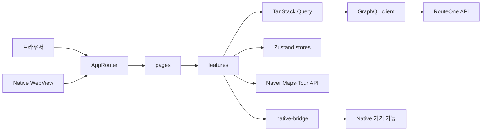

# RouteOne Web

`apps/web`은 React와 Vite 기반 RouteOne 클라이언트입니다. 브라우저에서 직접 실행할 수 있고, Native에서는 같은 빌드 결과물을 React Native WebView에 내장하거나 R2 원격 번들로 설치해 실행합니다.

[루트 README](../../README.md)에는 프로젝트 목적과 전체 서비스 구성을 정리해 두었습니다.

## 역할

- 현재 위치 또는 선택 지역을 기준으로 관광지·음식점·축제를 지도에서 탐색합니다.
- 저장한 장소를 날짜별 여행 루트로 구성하고 여행 시작·방문·완료 상태를 관리합니다.
- 완료된 공유 루트를 탐색하고 좋아요·저장·복제 흐름을 연결합니다.
- GraphQL API 호출과 TanStack Query 기반 서버 상태 캐시를 관리합니다.
- Zustand로 지역 탐색, 검색, 여행 담기, 상세 시트, 테마와 UI 상태를 공유합니다.
- WebView 브릿지로 Native의 위치, 알림, 사진, 외부 링크와 앱 정보를 사용합니다.
- 한국어와 영어 UI 및 관광지 현지화 결과를 화면에 반영합니다.

## 기술 스택

| 구분 | 기술 | 사용 범위 |
| --- | --- | --- |
| UI | React 19, TypeScript | 화면과 기능 컴포넌트, Hook과 타입을 구현합니다. |
| 빌드 | Vite 8 | 개발 서버, 브라우저 번들과 Native WebView 번들을 생성합니다. |
| 라우팅 | React Router 7 | 브라우저의 `BrowserRouter`와 WebView의 `HashRouter`를 구분합니다. |
| 서버 상태 | TanStack Query 5 | GraphQL과 관광 데이터 조회 결과, 로딩·오류·재조회를 관리합니다. |
| 클라이언트 상태 | Zustand 5 | 선택 지역, 검색, 여행 담기, 상세 시트, 테마와 토스트 상태를 관리합니다. |
| API 타입 | GraphQL Code Generator | GraphQL operation을 기준으로 typed document와 TypeScript 타입을 생성합니다. |
| 스타일 | Tailwind CSS 4 | 모바일 중심 레이아웃, 테마와 공통 UI 스타일을 구성합니다. |
| 지도 | Naver Maps JavaScript API | 지역 경계, 관광지 마커, 현재 위치와 지도 이동을 표시합니다. |
| 차트 | Chart.js, react-chartjs-2 | 관광지 트렌드 데이터를 시각화합니다. |
| 오류 수집 | Sentry | Web 런타임 오류와 최종 실패한 GraphQL 요청을 수집합니다. |

## 구조

```text
apps/web
├── public
├── src
│   ├── api             # REST·GraphQL 요청 진입점
│   ├── components      # 화면 간 공유 UI와 홈·지도·검색 컴포넌트
│   ├── data            # 서비스 지역과 정적 지역 데이터
│   ├── features        # 홈, 여행, 공유, 알림, 신고 등 기능 단위 코드
│   ├── generated       # GraphQL Code Generator 산출물
│   ├── graphql         # 도메인별 GraphQL operation
│   ├── hooks           # 인증과 화면 공통 Hook
│   ├── layouts         # 하단 탭 등 화면 레이아웃
│   ├── lib             # 지도·위치·인증·포맷 변환 유틸
│   ├── monitoring      # Sentry 초기화와 민감정보 제거
│   ├── native-bridge   # Web에서 Native 기능을 호출하는 어댑터
│   ├── pages           # 라우트 단위 화면
│   ├── router          # 공개·인증 라우트와 Browser/Hash Router 선택
│   ├── stores          # Zustand 전역 상태
│   └── types           # 전역·런타임 타입
├── codegen.ts
└── vite.config.ts
```

## 구성도



- `pages`는 라우트 화면의 데이터 연결과 UI 조합을 담당합니다.
- `features`는 홈 탐색, 여행 진행, 공유 루트, 알림과 신고처럼 기능별 컴포넌트·Hook·유틸을 묶습니다.
- TanStack Query는 서버와 외부 관광 데이터의 캐시를 관리하고, Zustand는 화면 간 공유가 필요한 클라이언트 상태를 관리합니다.
- 브라우저에서는 Web API와 직접 요청을 사용하고, WebView에서는 `native-bridge`를 통해 Native 기능과 네트워크 프록시를 사용합니다.

## 라우트별 기능

라우트는 `src/router/AppRouter.tsx`에서 관리합니다. 홈 지도와 장소 탐색은 공개하며, 공유 루트의 사용자 동작, 여행 저장 내역, 알림과 내 정보는 로그인 상태를 확인합니다.

| 경로 | 화면 | 주요 기능 |
| --- | --- | --- |
| `/` | 홈 리다이렉트 | `/home`으로 이동합니다. |
| `/login` | Web 로그인 | Native WebView를 사용하지 않는 Web 실행 환경에서 비밀번호 로그인을 처리합니다. 하이브리드 앱은 WebView 진입 전에 Native 로그인과 세션 주입을 사용합니다. |
| `/home` | 홈 지도 | 지역별 장소 탐색, 검색, 여행 담기와 장소 상세 시트를 제공합니다. |
| `/my-route` | 나의 여행 | 예정·진행 중인 여행 루트, DAY 일정과 방문 상태를 관리합니다. |
| `/shared-route` | 공유 루트 | 공개된 완료 루트를 탐색하고 좋아요·저장·복제를 처리합니다. |
| `/notifications` | 알림함 | 도착·축제·루트 회고 알림을 확인하고 읽음 상태를 변경합니다. |
| `/me` | 내 정보 | 여행 기록과 계정·언어·알림·앱 설정 메뉴로 이동합니다. |
| `/me/routes` | 다녀온 루트 | 완료했거나 지난 여행 루트를 확인합니다. |
| `/me/liked-routes` | 좋아요한 루트 | 좋아요를 표시한 공유 루트를 모아봅니다. |
| `/me/account` | 계정 정보 | 계정과 로그인 정보를 확인하고 탈퇴를 처리합니다. |
| `/me/language` | 언어 설정 | Web과 Native에서 사용할 언어를 변경합니다. |
| `/me/service-area` | 테스트 지역 | 개발 환경에서 서비스 권역을 바꿔 지도와 장소 데이터를 확인합니다. |
| `/me/notifications` | 알림 설정 | 축제, 루트 시작·후기와 도착 알림 설정을 관리합니다. |
| `/me/app-info` | 앱 정보 | Web·Native 버전과 위치·알림·카메라·앨범 권한을 확인합니다. |
| `/me/feedback` | 의견 보내기 | 사용자 의견을 작성해 외부 전달 흐름으로 연결합니다. |
| `/me/photo-reports` | 사진 신고 관리 | 권한이 있는 계정에서 방문 사진 신고를 검토합니다. |
| `/me/blocked-users` | 차단 사용자 | 차단한 사용자 목록을 확인하고 해제합니다. |

## 상태 관리

| 구분 | 담당 | 예시 |
| --- | --- | --- |
| 서버 상태 | TanStack Query | 알림함, 여행 루트, 공유 루트, 관광지와 축제 데이터 |
| 전역 UI 상태 | Zustand | 토스트, 로딩 오버레이, 테마, 장소 상세 시트 |
| 홈 탐색 상태 | Zustand | 선택 지역, 검색어, 장소 필터, 검색 결과 표시 개수 |
| 여행 담기 상태 | Zustand | 저장 장소, 체크아웃 모달, 기존 DAY 추가 대상 |
| 로컬 상태 | 컴포넌트·Hook | 팝업 열림 여부, input ref와 일시적인 처리 상태 |

## GraphQL과 외부 데이터

GraphQL endpoint는 브라우저 환경의 `VITE_GRAPHQL_ENDPOINT` 또는 WebView가 주입한 Native runtime 설정을 기준으로 결정합니다. Native에서는 `/graphql` 요청을 브릿지가 가로채 Native의 API endpoint로 전달하고 인증 헤더를 함께 적용합니다.

홈 지도는 공모전의 필수 활용 조건이었던 한국관광공사 API와 서비스 지역 경계 자산을 사용합니다. Native WebView에서는 `/tour-api/*` 요청을 Native 프록시가 처리해 TTL 캐시, 중복 요청 병합과 만료 캐시 fallback을 적용합니다.

## Native 브릿지

Web 기능은 Native 모듈을 직접 import하지 않고 `src/native-bridge`의 어댑터를 사용합니다.

| 영역 | 주요 기능 |
| --- | --- |
| 앱 정보 | 앱·Web 번들 버전, 플랫폼과 권한 상태 조회 |
| 인증 | Native 로그인 token 수신·동기화와 로그아웃 요청 |
| 위치 | 현재 GPS 조회, 권한 상태 확인과 설정 화면 이동 |
| 알림 | Push Token, 축제·도착·루트 회고 알림 동기화 |
| 미디어 | 방문 사진 촬영·선택·업로드, 포토카드 저장·공유 |
| 외부 링크 | 네이버 지도 앱, 시스템 설정과 외부 URL 열기 |
| 생명주기 | 앱 활성화와 Native 알림 수신 이벤트 전달 |

## 빠른 시작

```bash
pnpm install
pnpm dev:web
```

기본 개발 서버 주소는 `http://localhost:5173`입니다.

## 환경변수

| 변수 | 필요 조건 | 설명 |
| --- | --- | --- |
| `VITE_NCP_MAPS_KEY_ID` | 지도 사용 시 필수 | Naver Maps JavaScript API Key ID입니다. |
| `VITE_NCP_MAPS_KEY` | 환경에 따라 선택 | 지도 또는 Native 네트워크 설정에서 사용하는 NCP Key입니다. |
| `VITE_NCP_MAPS_DARK_STYLE_ID` | 선택 | 다크 모드 지도 스타일 ID입니다. |
| `VITE_VISITKOREA_SERVICE_KEY` | 관광지 조회 시 필수 | 한국관광공사 Tour API 서비스 키입니다. |
| `VITE_GRAPHQL_ENDPOINT` | 선택 | 기본값 대신 사용할 GraphQL endpoint입니다. |
| `VITE_GRAPHQL_REQUEST_TIMEOUT_MS` | 선택 | GraphQL 요청 제한 시간입니다. |
| `VITE_GRAPHQL_MAX_RETRY_COUNT` | 선택 | GraphQL 요청 최대 재시도 횟수입니다. |
| `VITE_SENTRY_DSN` | 오류 수집 사용 시 | `routeone-web` Sentry 프로젝트 DSN입니다. |
| `VITE_SENTRY_ENVIRONMENT` | 선택 | Sentry 환경 이름입니다. |
| `VITE_SENTRY_RELEASE` | 선택 | Web 배포 버전과 연결할 릴리스 이름입니다. |
| `VITE_APP_VERSION` | 선택 | 화면에 표시할 Web 버전입니다. |

## GraphQL 타입 생성

```bash
pnpm --filter web codegen
```

## 빌드와 검증

```bash
pnpm --filter web lint
pnpm --filter web build
pnpm --filter web preview
```

## Native Web 번들 배포

`develop` 브랜치 변경은 dev 채널, `main` 브랜치 변경은 prod 채널로 Web을 빌드해 Cloudflare R2에 게시합니다. Native 앱은 채널의 `latest/manifest.json`을 확인하고 새 번들을 staging 경로에서 검증한 뒤 active 번들로 교체합니다. 설치나 실행에 실패하면 이전 또는 내장 번들로 복구합니다.

## 오류 모니터링

Web 화면 오류와 최종 실패한 GraphQL 요청은 Sentry로 전송합니다. 사용자 식별에는 내부 사용자 ID만 사용하고 요청 본문, URL query, 쿠키와 인증 헤더는 전송 전에 제거합니다. DSN이 없으면 Sentry를 초기화하지 않습니다.
